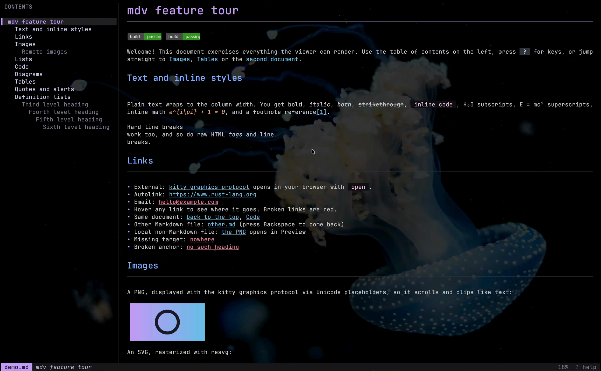
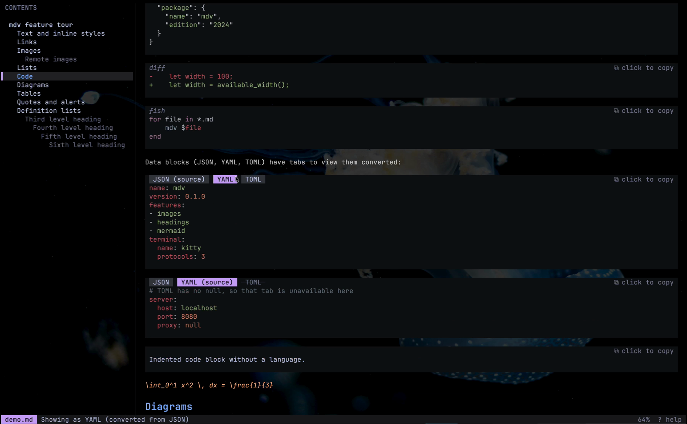
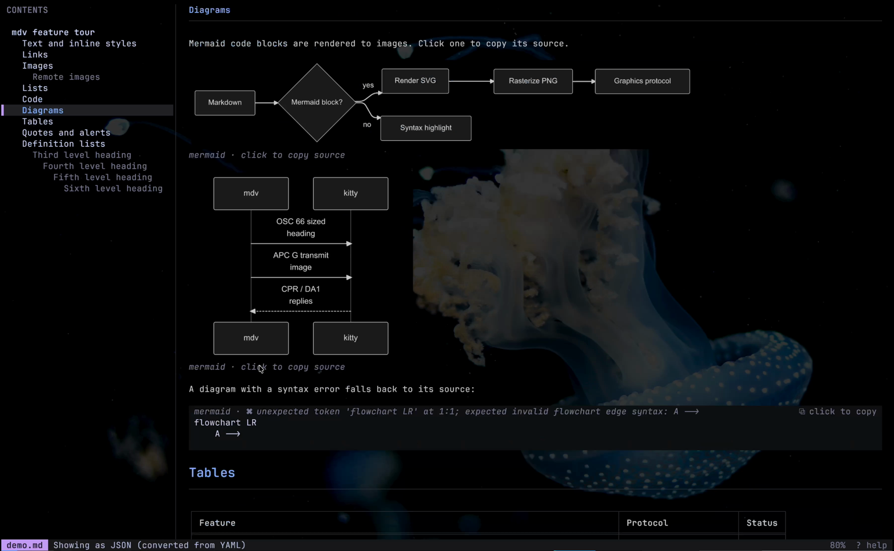

<h1 align="center">Kitty Markdown Viewer</h1>

<p align="center">
  <strong>A full-screen Markdown viewer for the <a href="https://sw.kovidgoyal.net/kitty/">kitty</a> terminal.</strong><br>
  Real images, big headings, rendered Mermaid diagrams, clickable links and a live table of contents,<br>
  right where you're already working.
</p>

<p align="center">
  <a href="LICENSE"></a>
  
  
</p>

<!--
  For an inline video player: edit this file on github.com, drag docs/demo.mp4 into the
  editor, and replace the screenshot link below with the github.com/user-attachments URL
  GitHub inserts. Repository-relative videos only show up as links.
-->
<p align="center">
  <a href="docs/demo.mp4">
    
  </a>
  <br>
  <sub>▶ <a href="docs/demo.mp4">Watch the demo video</a> (25 s)</sub>
</p>

Most terminal Markdown viewers have to work within plain text: headings are just bold, images are
a filename, diagrams are a code block. kitty can do more, and **Kitty Markdown Viewer** (`mdv`)
uses all of it. It draws images with kitty's
[graphics protocol](https://sw.kovidgoyal.net/kitty/graphics-protocol/), renders headings at
larger sizes with the
[text sizing protocol](https://sw.kovidgoyal.net/kitty/text-sizing-protocol/), and copies through
the [clipboard protocol](https://sw.kovidgoyal.net/kitty/clipboard/). The result reads more like a
rendered page than a terminal dump. It's a single Rust binary that starts in about 20 ms.

## Features

### Rendering

- **Big headings.** H1 is drawn at 2× and H2 at 1.5× using the text sizing protocol, with
  colored, underlined section rules.
- **Images inline.** PNG, JPEG, GIF, WebP, BMP and SVG, from local paths, `http(s)` URLs or
  `data:` URIs. They load in the background and are drawn with Unicode placeholders, so they
  scroll and clip like text. Small images such as badges flow inline with the text.
- **Mermaid diagrams.** ` ```mermaid ` blocks are rendered to images in-process (no Node.js,
  no headless browser) and match your light or dark theme. A diagram that doesn't parse falls
  back to its source, with the error in the header.
- **Syntax highlighting** for [bat](https://github.com/sharkdp/bat)'s whole language set:
  JavaScript/TypeScript (JSX/TSX), Rust, Go, Python, Ruby, Java, Kotlin, C/C++, Objective-C,
  PHP, Perl, Lua, SQL, HTML, XML, CSS/SCSS/Sass, JSON, YAML, TOML, protobuf, Diff, Bash, Fish and
  more, plus a bundled grammar for Prisma.
- **Convert data blocks.** JSON, YAML and TOML code blocks get tabs in their header to view the
  same data in the other formats. The original is marked, and formats the data can't be expressed
  in are struck out (TOML has no `null`, for example).
- **GitHub-flavored Markdown:** tables with alignment, task lists, strikethrough, footnotes,
  alerts (`> [!NOTE]`, `[!TIP]`, `[!WARNING]`…), definition lists, math, front matter, and inline
  HTML such as ``, `<br>`, `<kbd>`, `<sub>` and `<sup>`.
- **Themes** follow your terminal: `mdv` asks kitty for its background color and picks a light or
  dark palette (based on [Catppuccin](https://catppuccin.com)) that blends in.

### Navigation and links

- **Table of contents** sidebar that highlights the section you're reading. Click an entry to
  jump to it, or press `t` to hide it and let the text use the full width.
- **Links that do something.** `#anchors` jump to the heading, links to other Markdown files
  open in the viewer (with back navigation), and URLs and other files open with `open` on macOS
  or `xdg-open` on Linux.
- **Hover a link** to see where it goes. Links to local files or headings that don't exist are
  drawn in red, so broken links stand out.
- **Search** with `/`, step through matches with `n` / `N`.
- **Live reload:** keep the viewer open while you edit, and it refreshes when the file changes.

### Copying

- **Click a code block** (or a diagram) to copy its source.
- **Drag to select**, like tmux copy mode. You get the *Markdown source* of the selection, markup
  included: select a bold word and get `**bold**`, select a list and get `- item` lines, select a
  table and get its pipes.
- Uses kitty's clipboard protocol, and falls back to OSC 52 in other terminals and in tmux.

<table>
  <tr>
    <td width="50%"></td>
    <td width="50%"></td>
  </tr>
  <tr>
    <td align="center"><sub>JSON shown as YAML, with format tabs</sub></td>
    <td align="center"><sub>Mermaid diagrams rendered inline</sub></td>
  </tr>
</table>

## Installation

### Prebuilt binaries

Every [release](https://github.com/calii23/kitty-markdown-viewer/releases/latest) has a
ready-to-run `mdv` for each platform kitty runs on:

| Platform | Archive |
|---|---|
| macOS, Apple silicon | `mdv-<version>-aarch64-apple-darwin.tar.gz` |
| macOS, Intel | `mdv-<version>-x86_64-apple-darwin.tar.gz` |
| Linux, x86_64 | `mdv-<version>-x86_64-unknown-linux-musl.tar.gz` |
| Linux, ARM64 | `mdv-<version>-aarch64-unknown-linux-musl.tar.gz` |
| FreeBSD, x86_64 | `mdv-<version>-x86_64-unknown-freebsd.tar.gz` |

The Linux builds are static, so they run on any distribution. Unpack the archive and put `mdv`
somewhere on your `PATH`:

```sh
tar -xzf mdv-*.tar.gz
mv mdv-*/mdv ~/.local/bin/
```

The macOS binaries aren't signed. If you downloaded one with a browser and macOS refuses to run
it, clear the quarantine flag with `xattr -d com.apple.quarantine ~/.local/bin/mdv`.

### From source

You need a recent [Rust toolchain](https://rustup.rs) (1.88 or newer).

```sh
cargo install --git https://github.com/calii23/kitty-markdown-viewer
```

Or from a checkout:

```sh
git clone https://github.com/calii23/kitty-markdown-viewer
cd kitty-markdown-viewer
cargo install --path .
```

This installs the `mdv` binary into `~/.cargo/bin`.

## Usage

```sh
mdv README.md             # open a file
mdv examples/demo.md      # a tour of everything it renders
cat notes.md | mdv        # read from standard input
```

| Option | |
|---|---|
| `--no-toc` | Start with the table of contents hidden |
| `--no-images` | Don't load or show images (or render diagrams) |
| `--no-text-sizing` | Draw headings at normal size |
| `--width N` | Cap the text column at `N` cells (by default it fills the window) |
| `--theme auto\|dark\|light` | Pick the palette; `auto` asks the terminal |
| `--dump` | Print the laid-out document as plain text and exit |
| `--probe` | Print the terminal capabilities `mdv` detected and exit |

Set `MDV_OPENER` to choose what opens external links, for example `MDV_OPENER="open -a Firefox"`.

### Keys

| Key | Action |
|---|---|
| `j` `k` / `↓` `↑` | Scroll by line |
| `d` `u` | Half a page down / up |
| `Space` `b` / `PgDn` `PgUp` | A page down / up |
| `g` `G` / `Home` `End` | Top / bottom |
| `]` `[` | Next / previous heading |
| `1`–`9` | Jump to a top-level section |
| `Tab` `Shift-Tab` | Focus the next / previous link |
| `Enter` | Follow the focused link |
| `Backspace` / `h` | Go back |
| `/` `n` `N` | Search, next / previous match |
| `t` | Toggle the table of contents |
| `r` | Reload |
| `Esc` | Clear the selection, link focus or search |
| `?` | Show all keys |
| `q` | Quit |

### Mouse

| Action | Does |
|---|---|
| Scroll wheel | Scroll |
| Click a link | Follow it |
| Hover a link | Show its target |
| Click a contents entry | Jump to that section |
| Click a code block or diagram | Copy its source |
| Click a JSON / YAML / TOML tab | Show the block in that format |
| Drag | Select, and copy the Markdown source on release |
| Right-click | Go back |

## Terminal support

`mdv` is built for kitty, and kitty is where every feature works. At startup it asks the terminal
what it supports and quietly falls back where something is missing: headings are drawn at normal
size in color, and images show as clickable alt text.

| Feature | kitty | tmux (in kitty) | Other terminals |
|---|---|---|---|
| Big headings | ✓ (0.40+) | – | – |
| Images and diagrams | ✓ | ✓ with passthrough | Only if they support kitty's graphics protocol with Unicode placeholders |
| Copy to clipboard | ✓ | ✓ (OSC 52) | ✓ where OSC 52 is supported |
| Everything else | ✓ | ✓ | ✓ |

Inside tmux, turn passthrough on so images reach kitty:

```tmux
set -g allow-passthrough on
```

Run `mdv --probe` to see what was detected in your terminal.

## How it works

`mdv` draws every frame itself with [crossterm](https://github.com/crossterm-rs/crossterm) rather
than a TUI framework, because kitty's protocols don't fit a plain cell grid: a scaled heading
covers several rows, and an image is a block of placeholder cells.

| Module | Job |
|---|---|
| `probe.rs` | Asks the terminal what it supports: text sizing (via cursor position reports), graphics, cell size, background color and clipboard |
| `doc.rs` | Parses Markdown with [pulldown-cmark](https://github.com/pulldown-cmark/pulldown-cmark), keeping each piece's source position for copying |
| `layout.rs` | Wraps the document into terminal lines: lists, quotes, tables, code blocks, scaled headings and image cells |
| `render.rs` | Draws each frame in one synchronized update, so full redraws don't flicker |
| `kitty.rs` | Encodes graphics commands, Unicode image placeholders and OSC 66 sized text |
| `images.rs` | Loads, decodes and rasterizes images and Mermaid diagrams on background threads |
| `convert.rs` | Converts JSON, YAML and TOML between each other, keeping key order |
| `app.rs` | State and input: scrolling, links, search, history, selection and copying |

## Development

```sh
cargo test                          # unit tests
cargo run -- examples/demo.md       # try it on the feature tour
cargo run -- --dump README.md       # check the layout without a terminal UI
```

[`examples/demo.md`](examples/demo.md) exercises every feature and is the quickest way to see a
change. The demo video is stored with [Git LFS](https://git-lfs.com), so run `git lfs install`
before cloning if you want it locally.

### Releasing

Releases are built by [GitHub Actions](.github/workflows/release.yml). Bump `version` in
`Cargo.toml`, commit, then push a matching tag:

```sh
git tag v0.2.0
git push origin v0.2.0
```

The workflow builds all five platforms, attaches the archives and their SHA-256 checksums to a
new GitHub release with generated notes, and publishes it once every build succeeds.

## Acknowledgements

Kitty Markdown Viewer builds on great work by others:
[kitty](https://sw.kovidgoyal.net/kitty/) and its terminal protocols by Kovid Goyal,
[pulldown-cmark](https://github.com/pulldown-cmark/pulldown-cmark),
[syntect](https://github.com/trishume/syntect) with bat's syntaxes via
[two-face](https://codeberg.org/CosmicHarper/two-face),
[resvg](https://github.com/linebender/resvg),
[mermaid-rs-renderer](https://github.com/1jehuang/mermaid-rs-renderer),
[crossterm](https://github.com/crossterm-rs/crossterm) and the
[Catppuccin](https://catppuccin.com) palette.

## License

[MIT](LICENSE) © Lucy Schelbach
