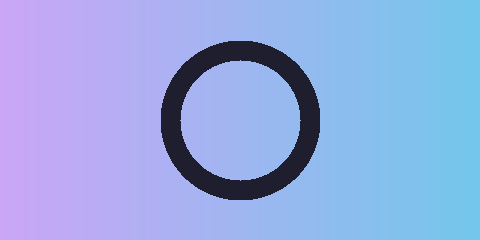
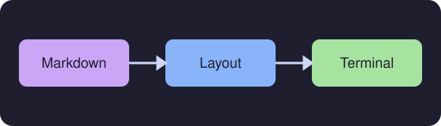
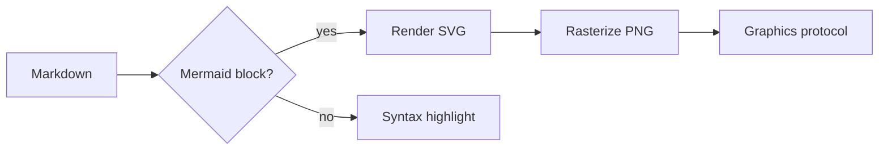
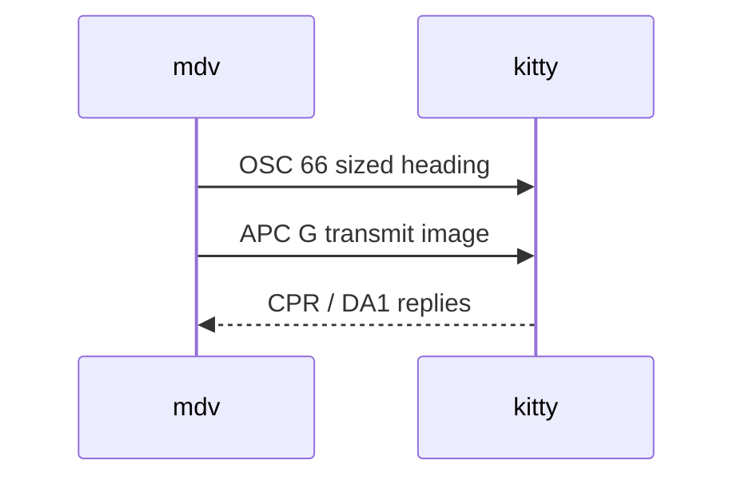

# Kitty Markdown Viewer feature tour

 

Welcome! This document exercises everything the viewer can render. Use the
table of contents on the left, press <kbd>?</kbd> for keys, or jump straight
to [Images](#images), [Tables](#tables) or the [second document](other.md#links-back).

## Text and inline styles

Plain text wraps to the column width. You get **bold**, *italic*, ***both***,
~~strikethrough~~, `inline code`, H<sub>2</sub>O subscripts, E = mc<sup>2</sup> superscripts,
inline math $e^{i\pi} + 1 = 0$, and a footnote reference[^1].

Hard line breaks\
work too, and so do raw <b>HTML</b> <i>tags</i> and line<br>breaks.

## Links

- External: [kitty graphics protocol](https://sw.kovidgoyal.net/kitty/graphics-protocol/)
  opens in your browser with `open`.
- Autolink: <https://www.rust-lang.org>
- Email: <hello@example.com>
- Hover any link to see where it goes. Broken links are red.
- Same document: [back to the top](#kitty-markdown-viewer-feature-tour), [Code](#code)
- Other Markdown file: [other.md](other.md) (press Backspace to come back)
- Local non-Markdown file: [the PNG](assets/gradient.png) opens in Preview
- Missing target: [nowhere](does-not-exist.md)
- Broken anchor: [no such heading](#no-such-heading)

## Images

A PNG, displayed with the kitty graphics protocol via Unicode placeholders,
so it scrolls and clips like text:



An SVG, rasterized with resvg:



An image that fails to load shows its alt text: 

### Remote images


## Lists

1. First ordered item
2. Second, with a nested list
   - Bullet
     - Deeper bullet
       - Deepest bullet
3. Third

- [x] Task done
- [ ] Task to do
- [ ] Another task with a long description that will need to wrap onto the next line when the terminal is narrow

Loose list:

- Paragraph one in a loose list.

- Paragraph two, with a second paragraph:

  Indented continuation paragraph.

## Code

```rust
use std::collections::HashMap;

/// Counts words in a string.
fn word_count(text: &str) -> HashMap<&str, usize> {
    let mut counts = HashMap::new();
    for word in text.split_whitespace() {
        *counts.entry(word).or_insert(0) += 1;
    }
    counts
}
```

```python
def fib(n: int) -> int:
    return n if n < 2 else fib(n - 1) + fib(n - 2)
```

```bash
cargo install --path . && mdv README.md
```

```tsx
export function Greeting({ name }: { name: string }) {
  return <h1 className="title">Hello, {name}!</h1>;
}
```

```kotlin
data class User(val id: Int, val name: String)

fun main() = listOf(User(1, "Ada")).forEach { println(it.name) }
```

```prisma
model User {
  id    Int     @id @default(autoincrement())
  email String  @unique
  posts Post[]
}
```

```toml
[package]
name = "kitty-markdown-viewer"
edition = "2024"
```

```diff
-    let width = 100;
+    let width = available_width();
```

```fish
for file in *.md
    mdv $file
end
```

Data blocks (JSON, YAML, TOML) have tabs to view them converted:

```json
{
  "name": "mdv",
  "version": "0.1.0",
  "features": ["images", "headings", "mermaid"],
  "terminal": { "name": "kitty", "protocols": 3 }
}
```

```yaml
# TOML has no null, so that tab is unavailable here
server:
  host: localhost
  port: 8080
  proxy: null
```

    Indented code block without a language.

$$
\int_0^1 x^2 \, dx = \frac{1}{3}
$$

## Diagrams

Mermaid code blocks are rendered to images. Click one to copy its source.





A diagram with a syntax error falls back to its source:

```mermaid
flowchart LR
    A --> 
```

## Tables

| Feature          | Protocol            | Status |
|:-----------------|:--------------------|:------:|
| Scaled headings  | Text sizing (OSC 66) |   ✓    |
| Images           | Graphics protocol   |   ✓    |
| Links            | `open` / OSC 8      |   ✓    |
| A long cell that has to wrap because it contains far too much text for one line | — | ✓ |

| Right aligned | Numbers |
|--------------:|--------:|
| apples        |      42 |
| pears         |   1,337 |

## Quotes and alerts

> A plain blockquote. It can contain *formatting* and
> > nested quotes.

> [!NOTE]
> Useful information that users should know.

> [!TIP]
> Helpful advice for doing things better.

> [!IMPORTANT]
> Key information users need to know.

> [!WARNING]
> Urgent info that needs immediate attention.

> [!CAUTION]
> Advises about risks or negative outcomes.

## HTML

Block-level HTML, as found in many GitHub READMEs, is laid out too:

<p align="center">
   <br>
  <strong>Centered</strong> text &mdash; with entities &amp; a line break<br>
  <sub>and small print underneath</sub>
</p>

<div align="center">

### A centered Markdown heading

Markdown inside `<div align="center">` is centered as well.

</div>

<table>
  <thead>
    <tr><th>Element</th><th align="center">Becomes</th></tr>
  </thead>
  <tbody>
    <tr><td><code>&lt;h1&gt;</code>…<code>&lt;h6&gt;</code></td><td align="center">headings in the contents</td></tr>
    <tr><td><code>&lt;table&gt;</code></td><td align="center">a table, images included</td></tr>
    <tr><td><code>&lt;ul&gt;</code>, <code>&lt;ol&gt;</code></td><td align="center">lists</td></tr>
  </tbody>
</table>

<details>
<summary>Details are shown expanded</summary>
<ol>
  <li><input type="checkbox" checked disabled> HTML lists</li>
  <li><input type="checkbox" disabled> with checkboxes</li>
</ol>
</details>

<pre lang="rust"><code>fn main() {
    println!("&lt;pre&gt; blocks are highlighted");
}
</code></pre>

## Definition lists

Kitty
: A fast, feature-rich, GPU based terminal emulator.

Rust
: A language empowering everyone to build reliable and efficient software.

---

### Third level heading

#### Fourth level heading

##### Fifth level heading

###### Sixth level heading

[^1]: Footnotes are rendered at the end and their references are clickable.
